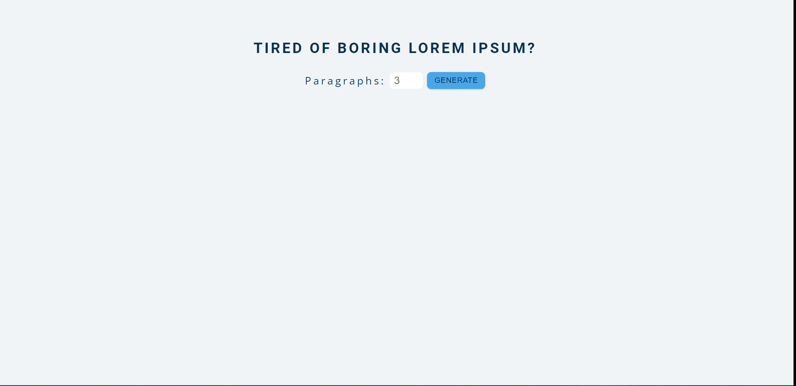

# 15 Vanilla JavaScript Projects

This project is a part of 15 vanilla JavaScript projects.

## Table of contents

- [Overview](#overview)
  - [Screenshot](#screenshot)
  - [Links](#links)
- [My process](#my-process)
  - [Built with](#built-with)
- [Author](#author)

## Overview

### Screenshot

### Links

- [View live](https://junaidshaikh-js.github.io/lorem-ipsum-generator/)

## My process

### Built with

- Semantic HTML5 markup
- CSS
- CSS Flexbox
- JavaScript

## Author

- Twitter - [@junaidshaikh_js](https://twitter.com/junaidshaikh_js)
- Linkedin - [@junaidshaikhjs](https://www.linkedin.com/in/junaidshaikhjs/)
